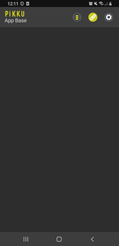
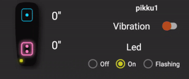
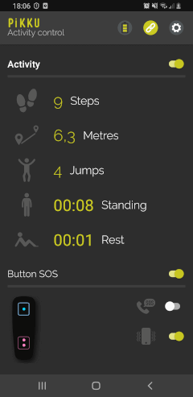

# Ejemplos
En este bloque de la documentación te presentamos código real que te va a ayudar en tus aplicaciones. Te ofrecemos código para implementar una app con la configuración mínima (Base), código con toda la funcionalidad completa (Full) y dos aplicaciones que usan la funcionalidad de los dispositivos para proporcionar datos y funciones extra a los usuarios (Activity y Snake).

Lee detenidamente sus características ya que durante su lectura te proponemos mejoras y acceso a información adicional.

## Aplicaciones de ejemplo

Este repositorio incluye 4 aplicaciones de demostración que ilustra el uso de esta biblioteca.
[Ver código](https://github.com/blautic/pikkuAcademy/tree/master/Examples/)

## Aplicación Base

Esta aplicación consta del código necesario mínimo para el uso del sistema: descubrimiento del pikku, gestión de la conexión y lectura de batería. Usa este código para no tener que empezar desde cero.  [Ver código](https://github.com/blautic/pikkuAcademy/tree/master/Examples/pikkuAcademyBase/)



Tal y como explicábamos en la documentación previa, en la librería existen métodos que te permiten descubrir aquellos PikkuAcademy que se encuentran cerca y que queremos conectar. Es nuestro primer objetivo para poder usar la aplicación.

En la aplicación de ejemplo tenemos disponible los siguientes iconos para representar el estado de la batería y la conexión

        


El siguiente metodo permite detectar aquel dispositivo Pikku cercano que mantenga presionado el botón 1 y guardar en la configuración de la librería su dirección MAC para las siguientes conexiones: 

```java
pikkuAcademy.scan(true, new ScanCallback() {
    @Override
    public void onScan(ScanInfo scanInfo) {
        binding.buttonSave.setOnClickListener(v ->{
            pikkuAcademy.saveDevice(scanInfo);
        });
    }
});
```

Una vez ya tenemos el dispositivo seleccionado debemos establecer conexión. En la aplicación debes pulsar el icono de conexión y esperar que se produzca la conexión. El icono cambia de color en ese momento y el código implementa la funcionalidad de lectura del estado de los recursos hardware disponibles.

```java
pikkuAcademy.connect(new ConnectionCallback() {
    @Override
    public void onConnect(ConnectionState state) {
        switch (state) {
            case CONNECTED: {
                binding.connectButton.setImageResource(R.drawable.ic_ble_connected);
                readValues();
                break;
            }
            case DISCONNECTED:
            case FAILED: {
                binding.connectButton.setImageResource(R.drawable.ic_ble_disconnected);
                break;
            }
        }
    }
});
```


Despues de establecer la conexión solicitamos el rssi y el estado actual de la batería, del led, del motor, etc.

```java
private void readValues() {
    pikkuAcademy.readRssiConnectedDevice(new RssiCallback() {
        @Override
        public void onReadSuccess(int rssi) {
            Log.d("rssi:", String.valueOf(rssi));
        }
    });

    pikkuAcademy.readStatusDevice(new StatusDeviceCallback() {
        @Override
        public void onReadSuccess(StatusDevice statusDevice) {
            Log.d("readStatusDevice", statusDevice.toString());
            updateBatteryIU(statusDevice.battery);
        }
    });
}
```


Según vamos recibiendo la información del dispositivo debemos actualizar nuestra interfaz para informar al usuario de los datos recibidos. En este caso vemos la actualización del icono de la batería en función del nivel restante. 

```java
private void updateBatteryIU(int value) {
    binding.battery.setImageResource(
            value > 75 ? R.drawable.ic_battery_3 :
                    value > 50 ? R.drawable.ic_battery_2 :
                            value > 25 ? R.drawable.ic_battery_1 :
                                    R.drawable.ic_battery_0);
}
```

Con esta aplicación has aprendido lo mínimo que se necesita para empezar a interactuar con el dispositivo Pikku. Fácil, ¿no?. Si sigues explorando en la documentación encontrarás otros ejemplos para acceder a todos los recursos hardware y que usan los datos para construir aplicaciones reales y utiles. Tan pronto te familiarices con el código empezarás a querer desarrollar tus propias ideas. 


# Full

Con la aplicación PikkuAcademyFull vas a ver cómo acceder y extraer todos los datos de los dispositivos. Antes de navegar por el código puedes descargarte la APP del Play Store de Google y probar su funcionalidad.

<a href="https://play.google.com/store/apps/details?id=com.blautic.pikkuacademyfull"></a>

El código de la aplicación visualiza el modo de utilizar la funcionalidad completa del dispositivo. Puedes extraer bloques ejemplo y probar su funcionamiento [Ver código](https://github.com/blautic/pikkuAcademy/tree/master/Examples/pikkuAcademyFull/)

Una de las primeras funciones que debes hacer para desarrollar aplicaciones es dominar el diseño de la interfaz de usuario. En este caso puedes utilizar la nuestra interfaz pero te proponemos que cambies los elementos, formatos y colores para adaptarlos a tus gustos y necesidades. 


Esta aplicación utiliza la aplicación base explicada anteriormente para gestionar la conexión con el dispositivo. Consulta este apartado si no te queda claro como realizar esta funcionalidad.

Para las aplicaciones de ejemplo hemos utilizado la vinculación de vistas que es una función que te permite escribir más fácilmente código que interactúa con las vistas. Una vez que la vinculación de vista está habilitada en un módulo, genera una clase de vinculación para cada archivo de diseño XML presente en ese módulo. Una instancia de una clase de vinculación contiene referencias directas a todas las vistas que tienen un ID en el diseño correspondiente. En la mayoría de los casos, la vinculación de vistas reemplaza a findViewById.

Para habilitar la vinculación de vista en un módulo, agrega el elemento viewBinding a su archivo build.gradle, como se muestra en el siguiente ejemplo:

```groovy
android {
        ...
        viewBinding {
            enabled = true
        }
    }
```

Iniciar ViewBinding

```java
public class HomeFragment extends Fragment {

    private FragmentHomeBinding binding;
    private PikkuAcademy pikkuAcademy;
    private final int RSSI_ONE_METER = 83;
    private boolean firstState = true;

    @Override
    public View onCreateView(
            LayoutInflater inflater, ViewGroup container,
            Bundle savedInstanceState
    ) {

        binding = FragmentHomeBinding.inflate(inflater, container, false);
        return binding.getRoot();

    }
```

Para mas información revisa la documentación de [ViewBinding](https://developer.android.com/topic/libraries/view-binding)

Una primera funcionalidad es el uso de los botones inalámbricos que proporciona el Pikku. Podemos pulsar los botones y recibir la información asociada: estado de pulsación del botón 1 y del botón 2 y el tiempo de pulsación en milisegundos. El tiempo de pulsación te permite distinguir entre pulsaciones cortas y largas.



Puedes usar estos botones para convertir el pikku en un control remoto de tus aplicaciones. Por ejemplo, un control de turnos, unos marcadores deportivos remotos, como botón de emergencia, disparar acciones remotas en el móvil, ... 

El siguiente código te permite leer el estado de los botones y obtener la duración en segundos actualizando al instante el texto asociado a cada botón en nuestra interfaz.

```java
pikkuAcademy.readButtons(new ButtonsCallback() {
    @Override
    public void onReadSuccess(int nButton, boolean pressed, int duration) {
        String durationSeconds = String.format("%.1f''", duration / 1000.0);
        //Button 1 or 2
        if (nButton == 1) {
            binding.button1Time.setText(durationSeconds);
        } else {
            binding.button2Time.setText(durationSeconds);
        }
    }
});
```


- Encender o apagar motor, 


```java
binding.switchVibration.setOnCheckedChangeListener((buttonView, isChecked) -> {
    if (isChecked) {
        pikkuAcademy.startEngine();
    } else {
        pikkuAcademy.stopEngine();
    }
});
```


- Encender o apagar led, en los recursos tenemos dos imagen para representar el led apagado o encendido, cambiamos la imagen dependiendo del estado del led .

    

```java
binding.radioGroupLed.setOnCheckedChangeListener(new RadioGroup.OnCheckedChangeListener() {
    @Override
    public void onCheckedChanged(RadioGroup group, int checkedId) {
        switch (checkedId) {
            case R.id.led_off:
                pikkuAcademy.turnOffLed();
                binding.imgPikkuNormal.setImageResource(R.drawable.ic_pikku_off);
                break;
            case R.id.led_on:
                pikkuAcademy.turnOnLed();
                binding.imgPikkuNormal.setImageResource(R.drawable.ic_pikku_on);
                break;
            case R.id.led_flashing:
                binding.imgPikkuNormal.setImageResource(R.drawable.ic_pikku_on);
                pikkuAcademy.flashingLed();
                break;
        }
    }
});
```

- RSSI para control de la distancia

  

  El rssi se usa para aproximar la distancia entre el dispositivo móvil y el Pikku usando como referencia el rssi medio a un metro de distancia. Utilizamos un ProgressBar para representar la distancia entre los dispositivos.

```java
pikkuAcademy.readRssiConnectedDevice(new RssiCallback() {
    @Override
    public void onReadSuccess(int rssi) {
        int distance = calculateDistance(rssi, RSSI_ONE_METER);
        binding.proximityBar.setProgress((100 - 10 * distance));
        binding.proximityText.setText(String.format("Proximity %d m", distance));
    }
});
```

- Obtenemos datos del accelerometro

```java
pikkuAcademy.readAccelerometer(new AccelerometerCallback() {
	@Override
    public void onReadSuccess(float x, float y, float z) {
    }

   @Override
   public void onReadAngles(float xy, float zy, float xz) {
                
   }
});
```

Los valores de la aceleración en g’s (1g equivale a 9,8m/sg2) del eje **x, y, z** y los grados de inclinacion del plano **xy, zy, xz**


Si el dispositivo inclina su plano XY respecto a la vertical, el ángulo α aumenta (situación inicial 0 grados). Lo mismo ocurre si inclina su plano ZY respecto la vertical, en este caso se incrementa en ángulo β desde una situación inicial de 0 grados.

Ejemplo inclinación del plano XY


Ejemplo inclinación del plano ZY


- Obtenemos datos del gyroscopio


```java
pikkuAcademy.readGyroscope(new GyroscopeCallback() {
    @Override
    public void onReadSuccess(float x, float y, float z) {

    }
});
```

GyroscopeCallback devuelve la velocidad angular en o/sg (grados por segundo) de los ejes **x, y, z**


# Activity 

<a href="https://play.google.com/store/apps/details?id=com.blautic.pikkuacademyActivity"></a>


Aplicación con guía paso a paso para control de pasos, distancia recorrida, pasos, tiempo de pie y en reposo y botón de emergencia [Ver código](https://github.com/blautic/pikkuAcademy/tree/master/Examples/pikkuAcademyActivity/)

 


Para detectar las actividad como caminar, el resultado no puede depender de si el usuario sostiene el dispositivo en posición vertical u horizontal, por lo que los valores individuales de X, Y y Z no servirán. En su lugar, tendrá que mirar la longitud del vector, es decir, sqrt (x² + y² + z²) que es independiente de la orientación del dispositivo.

Utilizando la [media móvil ponderada](https://en.wikipedia.org/wiki/Moving_average#Exponential_moving_average)  de la energía puede contar los pasos con solo buscar el máximo y el mínimo de sqrt (x² + y² + z²) cuando esta supere la media ponderada. Para detectar los saltos utilizamos la misma lógica de los pasos, pero en este caso aumentamos el umbral que tiene que alcanzar para considerarlo un salto.


```java
private final float thresholdStep = 0.15f, ;
private final float thresholdJump = 0.5f;

public void stepDetect(float x, float y, float z) {
    float accelCurrent = (float) Math.sqrt(Math.pow(x, 2)
            + Math.pow(y, 2) + Math.pow(z, 2));
    float beta = 0.2f;
    EWMA = (1 - beta) * EWMA + beta * accelCurrent;
    
    float delta = accelCurrent - EWMA;
    
    if (delta > thresholdStep && !isOverThreshold && (System.currentTimeMillis()-lastTimeMovementDetected) > 300) {
        isOverThreshold = true;
        lastTimeMovementDetected = System.currentTimeMillis();
        isMoving = true;
        steps++;
        movementListener.onStep(steps, steps * averageStepDistance);
    } else if(accelCurrent < EWMA){
        isOverThreshold = false;
        long timeDelta = (System.currentTimeMillis() - lastTimeMovementDetected);
        if (timeDelta > timeBeforeDeclaringStationary && isMoving) {
            isMoving = false;
            movementListener.onStand();
        }
    }
}
```


Declaramos **lastTimeMovementDetected** para guardar  el tiempo del ultimo paso detectado y descartamos los pasos en los siguientes 300 mili segundos, así evitamos que cuente el mismo paso mas de una vez. También declaramos **timeBeforeDeclaringStationary** que es el tiempo mínimo antes de empezar a detectar que la persona esta de pie sin ningún movimiento.

Para saber si la persona esta sentada detectamos los ángulos del acelerometro, cuando el plano xy o zy son mayores que 30 indicamos que la persona esta en reposo.

```java
public void setDataAngles(float xy, float zy, float xz) {
    if (Math.abs(xy) > 30 || Math.abs(zy) > 30 ) {
        long timeDelta = (System.currentTimeMillis() - lastTimeMovementDetected);
        if (timeDelta > timeBeforeDeclaringRest) {
            isRest = true;
            movementListener.onRest();
        }
    } else {
        isRest = false;
    }
}
```


- Botón de Emergencia


```java
private final int TIME_PRESS_BUTTON = 3000;

pikkuAcademy.readButtons(new ButtonsCallback() {
    @Override
    public void onReadSuccess(int nButton, boolean pressed, int duration) {
        if (binding.switchEnableCall.isChecked() && pressed && duration > TIME_PRESS_BUTTON) {
            callPhone();
        }
        if (binding.switchEnableVibrate.isChecked() && pressed && duration > TIME_PRESS_BUTTON) {
            vibrate();
        }
    }
});
```

Obtenemos el estado de los botones, establecemos un tiempo mínimo de pulsación del los botones en este caso hemos marcado 3 segundos, comprobamos que el Switch este habilitado, si estas dos condiciones se cumplen realizamos la llamada o la vibración del teléfono móvil para informar la emergencia.


```java
private void callPhone() {
    String number = checkExistNumberConfig();
    if (number != null) {
        call = true;
        Intent callIntent = new Intent(Intent.ACTION_CALL);
        callIntent.setData(Uri.parse("tel:" + number));
        startActivityForResult(callIntent, REQUEST_CODE_CALL);
    }

}
private void vibrate() {
    Vibrator v = (Vibrator) getContext().getSystemService(Context.VIBRATOR_SERVICE);
    if (Build.VERSION.SDK_INT >= Build.VERSION_CODES.O) {
        v.vibrate(VibrationEffect.createOneShot(5000, VibrationEffect.DEFAULT_AMPLITUDE));
    } else {
        v.vibrate(5000);
    }
}

```


# Snake Game

<a href="https://play.google.com/store/apps/details?id=com.blautic.pikkuacademySnake"></a>

Aplicación con guía paso a paso para convertir el pikku en un joystick inalábrico de respuesta a gestos y videojuego Snake [Ver Código](https://github.com/blautic/pikkuAcademy/tree/master/Examples/pikkuAcademySnake/)


Utilizando los ángulos del aceleramiento podemos ver la inclinación del dispositivo


```java
pikkuAcademy.readAccelerometer(new AccelerometerCallback() {
    @Override
    public void onReadSuccess(float x, float y, float z) {
    }
    @Override
    public void onReadAngles(float xy, float zy, float xz) {

        long stepStartTime = System.currentTimeMillis();
        if ((stepStartTime - stepPrevTime) > 300f) {
            if (Math.abs(xy) > 107) {
                animImg(binding.imgPikku, -20);
                stepPrevTime = stepStartTime;
                binding.snakeView.setSnakeDirection(GameType.TOP);
            } else if (Math.abs(xy) < 50) {
                animImg(binding.imgPikku, 20);
                stepPrevTime = stepStartTime;
                binding.snakeView.setSnakeDirection(GameType.BOTTOM);
            } else if (Math.abs(xz) > 107) {
                stepPrevTime = stepStartTime;
                binding.snakeView.setSnakeDirection(GameType.LEFT);
            } else if (Math.abs(xz) < 50) {
                stepPrevTime = stepStartTime;
                binding.snakeView.setSnakeDirection(GameType.RIGHT);
            }
        }
    }
});
```

SnakeView es una clase que extiende de View y se encarga de dibujar los rectángulos para la serpiente, comida y el grid. Para detectar la colisión comprobamos que la cabeza no toque el resto del cuerpo de la serpiente.


```java
//Collision detection
private void checkCollision() {
    GridPosition headerPosition = mSnakePositions.get(mSnakePositions.size() - 1);
    for (int i = 0; i < mSnakePositions.size() - 2 && !mIsEndGame; i++) {
        GridPosition position = mSnakePositions.get(i);
        if (headerPosition.getX() == position.getX() && headerPosition.getY() == position.getY()) {
            //stop the game
            mIsEndGame = true;
            if (callback != null) {
                new Handler(Looper.getMainLooper()).post(new Runnable() {
                    @Override
                    public void run() {
                        callback.onGameOver(mSnakeLength - LENGTH_INIT);
                    }
                });
            }
            return;
        }
    }

}
```
