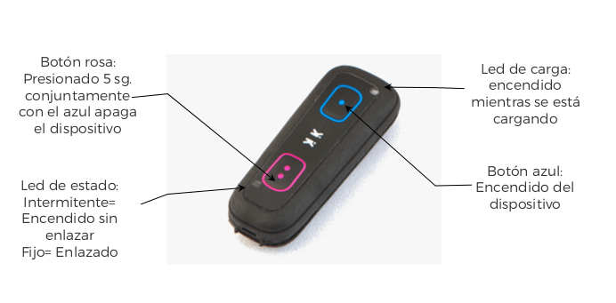

# MANUAL
Los dispositivos Pikku están provistos de sensores de acelerometría, giroscopio y magnetómetro, cada uno de ellos en sus tres ejes, disponen de dos Leds, un Motor y dos botones como se muestran en la figura:  

Los 3 ejes tienen la siguiente orientación y signos respecto a la envolvente:

Los sensores de giro y acelerometría tienen los siguientes ejes y signos:

En la siguiente tabla se puede ver la correspondencia entre ejes y signos:

| **ACELERÓMETRO Y GIROSCOPIO** | **+X** | **+Y** | **+Z** |
| ----------------------------- | ------ | ------ | ------ |

Las unidades y rangos que se usan en cada sensor son las siguientes:

- **ACELEROMETRO**: Aceleración en g’s (1g equivale a 9,8m/sg2). Rango ± 16G.
  Programable a ± 2G, ± 4G. ± 8G. ± 16G
- **GIROSCOPIO**: Velocidad angular en o/sg (grados por segundo). Rango ± 1.000 o/sg
