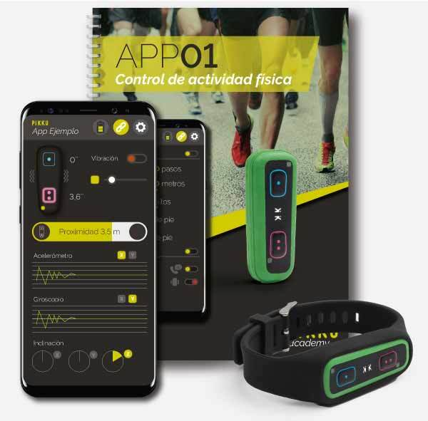
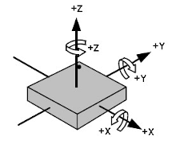

# MANUAL

## INTRODUCCIÓN

Los Pikku son dispositivos electrónicos inalámbricos que contienen las siguientes características técnicas:

|  |  |
|--|--|
| Alimentación |Batería LiPo recargable por microUSB |
|Autonomía | 6 horas con transmisión permanente de datos sin activación de motor|
|Indicadores |Led de estado de color azul  Led de recarga de color rojo|
|Comunicaciones | Inaĺámbricas BLE 4.2  Distancia: 20-30 metros según el entorno|
|Sensor de movimiento | Acelerómetro 3 ejes  Giroscopio 3 ejes|
|Interacción | 2 pulsadores  Motor de vibración (opción con motor) |

En la siguiente imágen se aprecia la ubicación de cada uno de los elementos

#### ENCENDIDO/APAGADO

**Encendido Pikku:** Presionar botón azul. El led azul indicará que el dispositivo se ha iniciado.

**Apagado Pikku:** Presionar los dos botones (azul y rosa) simultáneamente.

#### RECARGA

Conectar adaptador estándar microUSB en conector microUSB del dispositivo Pikku. El led rojo indica el estado de 
carga

#### SENSOR DE MOVIMIENTO

El sensor de movimiento cuenta con un acelerómetro de 3 ejes y un giroscopio de 3 ejes

Los ejes de funcionamiento de los sensores respecto del circuito integrado del dispositivo son los siguientes:

La equivalencia y posición del circuitor integrado respecto a la envolvente se aprecia en la siguiente figura:

Las unidades y rangos que se usan en cada sensor son las siguientes:

- **ACELEROMETRO**: Aceleración en g’s (1g equivale a 9,8m/sg2). Rango ± 16G.
  Programable a ± 2G, ± 4G. ± 8G. ± 16G
- **GIROSCOPIO**: Velocidad angular en o/sg (grados por segundo). Rango ± 1.000 o/sg.
  Programable a 250dps, 500dps, 1000dps, 2000dps.

